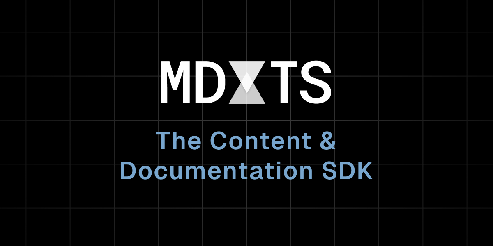

# mdxts

> **Warning**
> This project and all packages are still a work in progress. The APIs are not stable and may change.

Markdown by TypeScript. https://mdxts.dev/

Build a full knowledge graph between your Markdown and TypeScript files.

- Easily importable content
- Automated documentation
- Type-checked code blocks
- File-based routing
- Templating with Server Components

## License

[MIT][license] © [souporserious][https://souporserious.com/]
